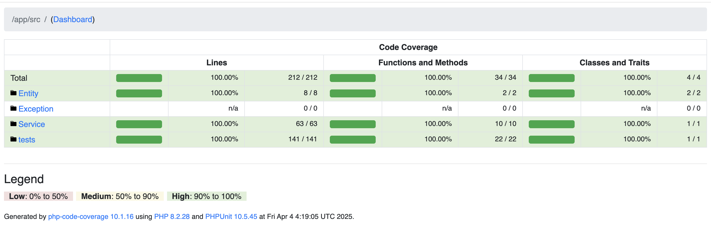

# DEMO UNIT TEST

## Environment Setup
- **PHP Version**: 8.0 or higher
- **PHPUnit Version**: 9.5 or higher
- **vfsStream Version**: 1.6 or higher
- **Mockery Version**: 1.4 or higher
- **Composer**: Ensure all dependencies are installed via `composer install`.
- **Database**: Ensure a test database is set up and accessible.
- **API**: Ensure a test API endpoint is available for mocking.
- **File System**: Ensure the `storage/` directory is writable for CSV file operations.
- **Permissions**: Ensure the test user has write permissions to the `storage/` directory.
- **Test Framework**: Ensure PHPUnit is configured to run tests in the `tests/` directory.
- **Test Coverage**: Ensure code coverage is enabled in PHPUnit configuration.
- **Test Runner**: Use `phpunit` command to run tests and generate coverage reports.

## How to Run Project
- Clone the repository: `git clone <repository-url>`
- Navigate to the project directory: `cd <project-directory>`
- Build and start docker containers: `docker-compose up --build -d`
- Install dependencies on docker container: `docker-compose exec php composer install`
- Run tests: `docker-compose exec php vendor/bin/phpunit --coverage-html coverage-report`

## Checklist

### OrderProcessingService

#### 1. Dependencies and Setup
- [x] Mock the `DatabaseService` interface to simulate database interactions.
- [x] Mock the `APIClient` interface to simulate API responses.
- [x] Test the constructor to ensure dependencies (`dbService` and `apiClient`) are properly injected.

#### 2. Main Method: `processOrders(int $userId)`
- [x] Test with an empty array of orders returned by `getOrdersByUser`.
- [x] Test with a single order of each type (A, B, C, and an unknown type).
- [x] Test with multiple orders of mixed types.
- [x] Test when `getOrdersByUser` throws a general exception (e.g., `\Exception`).

#### 3. Order Type A (CSV Export Logic)
- [x] Test successful CSV file creation with valid order data.
- [x] Test CSV content includes all fields (`ID`, `Type`, `Amount`, `Flag`, `Status`, `Priority`).
- [x] Test CSV includes a "High value order" note when `amount > 150`.
- [x] Test when `fopen` fails (e.g., simulate file system error) and status becomes `export_failed`.
- [x] Test status is set to `exported` on successful export.

#### 4. Order Type B (API Call Logic)
- [x] Test successful API call with `status = 'success'` and `data >= 50` and `amount < 100` (status = `processed`).
- [x] Test successful API call with `data < 50` (status = `pending`).
- [x] Test successful API call with `flag = true` (status = `pending`).
- [x] Test successful API call with `data >= 50`, `amount >= 100`, and `flag = false` (status = `error`).
- [x] Test API call with `status != 'success'` (status = `api_error`).
- [x] Test API call throwing `APIException` (status = `api_failure`).

#### 5. Order Type C (Flag-Based Logic)
- [x] Test with `flag = true` (status = `completed`).
- [x] Test with `flag = false` (status = `in_progress`).

#### 6. Unknown Order Type
- [x] Test with an invalid type (e.g., `D`) and verify status is set to `unknown_type`.

#### 7. Priority Logic
- [x] Test `amount > 200` sets `priority` to `high` for all order types.
- [x] Test `amount <= 200` sets `priority` to `low` for all order types.

#### 8. Database Update Logic
- [x] Test successful call to `updateOrderStatus` with correct `orderId`, `status`, and `priority`.
- [x] Test when `updateOrderStatus` throws `DatabaseException` (status = `db_error`).
- [x] Verify `updateOrderStatus` is called for each order processed.

#### 9. Return Values
- [x] Test that an array of processed orders is returned on success.
- [x] Test that `false` is returned when an unhandled exception occurs.
  - **Not applicable**: Refactored `processOrders` doesn’t return `false`.

#### 10. Edge Cases
- [x] Test with negative `userId`.
- [x] Test with `amount` as a negative value or zero.
- [x] Test with null or invalid values for `id`, `type`, `amount`, or `flag` in an `Order` object.
- [x] Test with a very large `amount` value (e.g., `PHP_INT_MAX`).

#### 11. File System Considerations (Type A)
- [ ] Test behavior when the CSV file already exists (overwrite scenario).
- [x] Test with insufficient permissions to write the CSV file.
- [x] Test that the storage directory is created if it doesn’t exist.
  - Covered by `testTypeAOrderCreatesStorageDirectory()`.

#### 12. Exception Handling
- [ ] Test catching of general `\Exception` in the outer `try-catch` block.
  - **Not applicable**: Refactored code removed this.
- [x] Test catching of `DatabaseException` in the inner `try-catch` block.
- [x] Test catching of `APIException` for type 'B' orders.

#### 13. Order Object State
- [x] Verify initial `status` is `new` and `priority` is `low` when an `Order` is constructed.
- [x] Verify `status` and `priority` are updated correctly based on processing logic.

#### 14. Mocking and Isolation
- [ ] Ensure tests do not rely on real file system operations (mock `fopen`, `fputcsv`, `fclose`).
  - **Partially implemented**: Tests use real file system (`glob`, `chmod`); `vfsStream` is initialized but not used.
- [x] Ensure tests do not make real API calls or database queries.

## Notes
- **Storage Directory**: `storage/` is excluded from coverage analysis to avoid permission issues during report generation.
- **File System**: Tests use real file system operations; consider mocking `$fileSystem` for better isolation.
- **Missing Tests**: Items like multiple mixed-type orders and null/invalid `Order` values are not covered.

## Code Coverage
Below is a screenshot of the code coverage report generated by PHPUnit:

